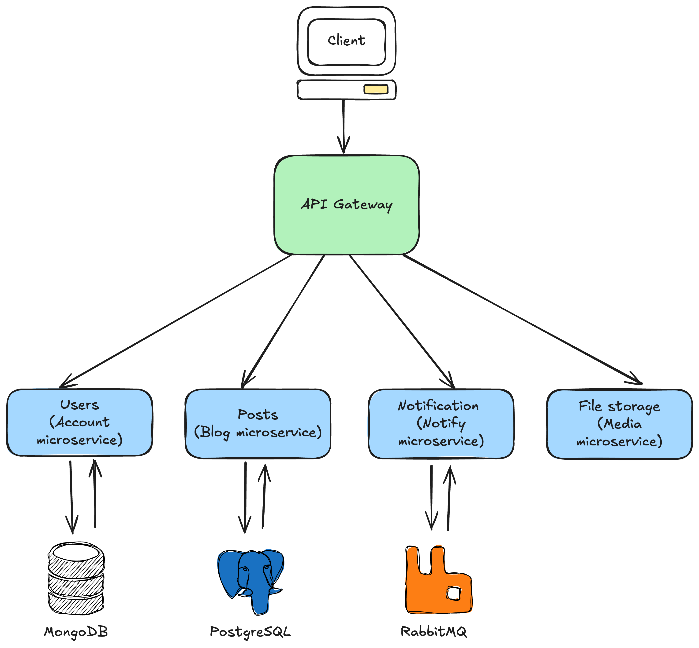

# Readme. Простой движок для блога

## О проекте

«Readme» — это простой headless-движок для блога, построенный с помощью микросервисной архитектуры и современного фреймворка Nest.js. Проект состоит из нескольких микросервисов [(схема проекта)](#схема-проекта), каждый сервис решает одну задачу.

## Запуск проекта

- Установить зависимости:

1. `cd ./project`
2. `npm install`

- Создать файлы `.env` на основе `.env-example` в папках `apps/account, apps/api, apps/blog, apps/media, apps/notify, libs/blog/models/prisma`

```
cp apps/account/account.env-example apps/account/account.env
cp apps/api/api.env-example apps/api/api.env
cp apps/blog/blog.env-example apps/blog/blog.env
cp apps/media/media.env-example apps/media/media.env
cp apps/notify/notify.env-example apps/notify/notify.env
cp apps/notify/rabbit.env-example apps/notify/rabbit.env
cp libs/blog/models/prisma/.env-example libs/blog/models/prisma/.env
```

- Запустить docker.desktop
- Запустить docker-контейнеры с БД: `npm run db:start`
- Остановить docker-контейнеры и удалить volumes можно командой `npm run db:stop`
- Запустить сервисы командой `npm run app:start`

_API Gateway (apps/api) является единой точкой входа. Примеры запросов приведены в файле apps/app.http_

## Переменные окружения

### Общие переменные

- ENVIRONMENTS - окружение ('development', 'production', 'stage')
- PORT - номер порта, на котором будет запущено приложение
- UPLOAD_DIRECTORY - путь для хранения загруженных файлов
- SERVE_ROOT - поддиректория для сохранения файлов
- HTTP_CLIENT_MAX_REDIRECTS - максимальное количество перенаправлений
- HTTP_CLIENT_TIMEOUT - таймаут

### Данные, необходимые для работы с БД и UI PosgreSQL

- POSTGRES_DB - имя БД
- POSTGRES_PORT - порт БД
- POSTGRES_USER - имя пользователя БД
- POSTGRES_PASSWORD - пароль БД
- PGADMIN_DEFAULT_EMAIL - имя пользователя PGADMIN
- PGADMIN_DEFAULT_PASSWORD - пароль PGADMIN
- PGADMIN_PORT - порт PGADMIN

### Данные, необходимые для работы с БД и UI MongoDB

- MONGO_DB - имя БД
- MONGO_HOST - хост БД
- MONGO_PORT - порт БД
- MONGO_USER - имя пользователя БД
- MONGO_PASSWORD - пароль БД
- MONGO_AUTH_BASE - имя пользователя интерфейса БД
- MONGO_UI_PORT - порт интерфейса БД

### Данные, необходимые для работы с RabbitMQ

- RABBIT_HOST - хост Rabbit
- RABBIT_PORT - порт Rabbit
- RABBIT_USER - имя пользователя Rabbit
- RABBIT_PASSWORD - пароль Rabbit
- RABBIT_QUEUE - очередь Rabbit
- RABBIT_EXCHANGE - exchange Rabbit
- RABBITMQ_DEFAULT_USER - имя пользователя по умолчанию Rabbit
- RABBITMQ_DEFAULT_PASS - пароль по умолчанию Rabbit

### Данные, необходимые для работы с FakeSMTP

- MAIL_SMTP_HOST - хост SMTP-сервера
- MAIL_SMTP_PORT - порт SMTP-сервера
- MAIL_USER_NAME - имя пользователя SMTP-сервера
- MAIL_USER_PASSWORD - пароль SMTP-сервера
- MAIL_FROM - адрес с которого будет производиться отправка почты

### Данные, необходимые для работы с JWT-токенами

- JWT_ACCESS_TOKEN_SECRET - секретный ключ ACCESS_TOKEN
- JWT_ACCESS_TOKEN_EXPIRES_IN - время жизни ACCESS_TOKEN
- JWT_REFRESH_TOKEN_SECRET - секретный ключ REFRESH_TOKEN
- JWT_REFRESH_TOKEN_EXPIRES_IN - время жизни REFRESH_TOKEN

# Доступ к API можно получить через Swagger по адресу: `http://localhost:3000/spec`

# Схема проекта


